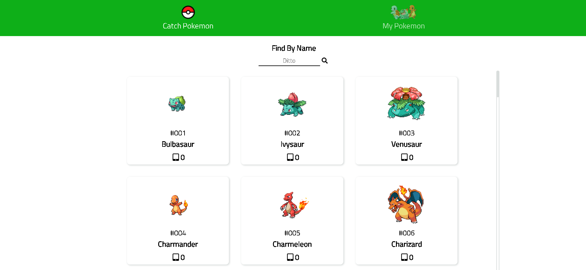

# Pokemon-wiki
**Pokemon-wiki** is a mobile desktop responsive website created for a pokemon fans to view pokemon's data and store favorite his pokemon. The website itself is build on **react js** and pull the data from **graphql-pokeapi**.

##  Check out the website: 
[Pokemon-wiki](https://pokemon-wiki.herokuapp.com/)

## graphql-pokeapi:
[graphql-pokeapi](https://github.com/mazipan/graphql-pokeapi)
